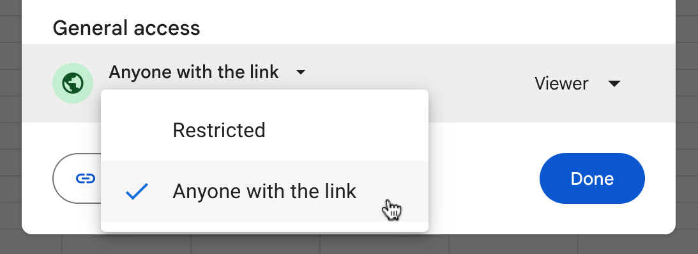

# dldu-points

A web application that shows a total and a detailed score when playing a DLDU run on stream. It's made for being integrated into OBS as a browser source. A Google Docs sheet is used the data source and changing it automatically update the current score.

## Demo

https://youtu.be/yrKhPNEN7qU

## Google Docs setup

- Open the [template Google Docs sheet](https://docs.google.com/spreadsheets/d/1WdxwX-zDKJikdGAqnbnBa7McvssiBd70TqeyY1R0y0o).
- Select `File` → `Make a copy`

- Set a file name and save it to your Google Drive.
- Change your sheet to be viewable by anyone with the link. To do this, click to Share button in Google Docs at the top right and click this button:

- In the URL of your browsers address bar you will see the sheet id. You need that sheet ID during the OBS setup, so copy it now. It's the numbers and letters (and maybe symbols) between `spreadsheets/d/` and `/edit`:

## OBS setup

A deployed and hosted version of the website exists, but it isn't public. Contact stareintheair#7130 on Discord to request access.

- Insert your sheet id into the URL I will send you.
- Create a new browser source and use the URL you just created.
- Set the width to 350 and the height to 500. Width and height can be adjusted to your needs. The website automatically uses all available space.
- Check `Shutdown source when not visible` to save resources.

## Structure of the Google sheet

You can share access to the Google sheet with moderators and trusted viewers, so they can update the score live during the stream for you.

- All bosses defined below a level belong to that level.
- Incomplete rows and rows with invalid values will be ignored by the website. Valid rows will still be displayed.

### Bosses

- If a boss was beaten check the checkmark in the fourth column.
- New bosses can be added as a new row in the Google sheet and are automatically shown on the website. Make sure to set the type in the first column to `boss`.
- The order of bosses can be switched by reordering the rows.
- Alive bosses will appear in gray.
- Beaten bosses will appear in white.

### Levels

- Bosses in a level will only be shown on the website if at least one boss, but not all bosses in that level were beaten.
- You can force always showing bosses of a level, by checking the checkmark in the fifth column.
- If you want the same behavior as in version 1, check all the boxes in the fifth column.
- The points of a level will appear in gray, when bosses there are still alive.
- The points of a level will appear in white, when all bosses there still beaten.
- New bosses can be added as a new row in the Google sheet and are automatically shown on the website. Make sure to set the type in the first column to `level`.
- Levels with no bosses will be ignored.
- The order of levels can be switched by reordering the rows.

## Configuration options

### Seconds per page

By default each page is displayed 10 seconds. This delay can be changed by adding an additional query parameter to the URL. Append `&secondsPerPage=5` to the URL to half the display time of each page:

### Progress bar

A progress bar that visualizes how many points where already achiveved can be shown in addition. Each boss has its own position in the progress bar, i.e. early bosses appears on the left and later ones on the right. The bar is not shown by default. Append `&showProgressBar` to the URL to enable it (same location as with seconds per page):

### Text size

The text size can be increased and decreased if necessary. This is better than scaling the browser source itself, because it will keep the text sharp. Use the OBS custom CSS override to change the text size. Add `font-size: 1.3rem;` to the body style section as seen an the screenshot here:

`1rem` doesn't change the size, `0.8rem` decreases the size by 20 %, and `2rem` doubles it. The width and height of the browser source probably need to be adapted as well.

### Left aligned layout

The default layout is designed to be placed on the right side of the screen. If you want to put it on the left, use the following CSS body style to switch the columns: `direction: rtl;` Put in the same place as in the screenshot above.
