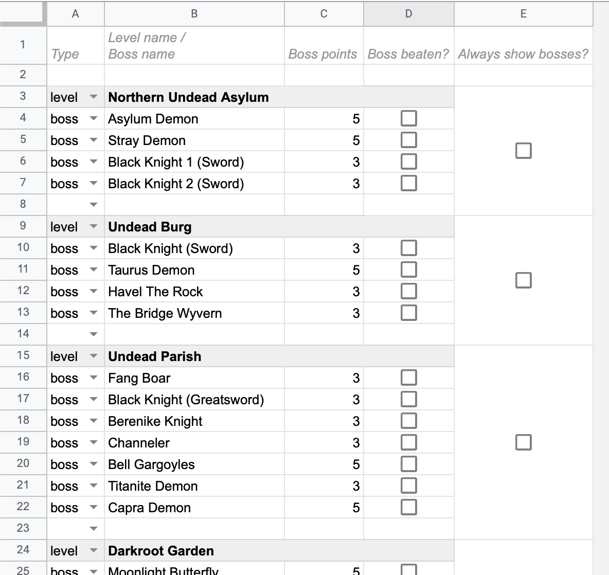

# dldu-points

A web application that displays a total and detailed score during a DLDU run on stream. It is designed to integrate into OBS as a browser source. The application uses a Google Docs sheet as its data source, ensuring that any changes made to the sheet automatically update the score in real-time.

## Demo

https://youtu.be/yrKhPNEN7qU

## Google Docs setup

- Open the [Google Docs sheet template](https://docs.google.com/spreadsheets/d/1WdxwX-zDKJikdGAqnbnBa7McvssiBd70TqeyY1R0y0o).
- Select `File` → `Make a copy`

- Name the document and save it to your Google Drive.
- Adjust the sharing settings of your sheet so that anyone with the link can view it. To do this, click the Share button in the top-right corner of Google Docs, and then click this button:

- Locate the sheet ID in your browser's address bar (in the URL). You will need this sheet ID during the OBS setup, so copy it now. The sheet ID is the string of numbers, letters, and possibly symbols between `spreadsheets/d/` and `/edit`:

## OBS setup

A hosted version of the website is available but not public. Contact [stareintheair](https://discord.com/users/277888096757088256) on Discord to request access. I also speak German 😉

- Paste your sheet ID into the URL I will provide.
- Create a new browser source and use the URL you just created.
- Set the width to 350 and the height to 500. Width and height can be adjusted to your needs. The website will automatically use all available space.
- Check `Shutdown source when not visible` to save resources.

### Progress bar

Below the total points is a progress bar that visualizes how many points have already been achieved. Each boss has its own position in the progress bar, i.e. early bosses appear on the left and later bosses on the right:

## Structure of the Google Sheet

You can share access to the Google Sheet with moderators or trusted viewers, so that they can update the score for you live during the stream.

- All bosses defined below a level belong to that level.
- Incomplete rows and rows with invalid values will be ignored by the website. Valid rows are still displayed.

### Bosses

- When a boss is defeated, check the box in the fourth column.
- New bosses can be added as a new row in the Google Sheet and will be automatically displayed on the website. Make sure the type in the first column is set to `boss`.
- The order of the bosses can be changed by reordering the rows.
- Living bosses appear in gray.
- Defeated bosses appear in white.

### Levels

- Bosses in a level will only appear on the website if at least one, but not all, of the bosses in that level have been defeated.
- You can force the bosses of a level to always be displayed by checking the box in the fifth column.
- If you want the same behavior as in version 1, check all the boxes in the fifth column.
- The points of a level will be displayed in gray if at least one boss of that level is still alive.
- The points of a level will be displayed in white if all the bosses in that level have been defeated.
- New bosses can be added as a new row in the Google Sheet and will be automatically displayed on the website. Make sure the type in the first column is set to `level`.
- Levels without bosses will be ignored.
- The order of the levels can be changed by reordering the rows.

## Configuration options

### Seconds per page

By default each page is displayed for 10 seconds. This delay can be changed by adding an additional query parameter to the URL. Append `&secondsPerPage=5` to the URL to halve the display time of each page:

### Hide progress bar

To hide the green points progress bar, append `&hideProgressBar` to the URL (same location as seconds per page).

### Hide levels without points

To show only levels with points and hide all levels without points, add `&hideLevelsWithNoPoints` to the URL (same location as with seconds per page). When starting a new run, no levels will be visible until the first boss is defeated.

### Text size

The text size can be increased or decreased if necessary. This is better than scaling the browser source itself, because it keeps the text sharp. Use the OBS custom CSS override to change the text size. Add `font-size: 1.3rem;` to the body style section as shown in the screenshot here:

`1rem` doesn't change the size, `0.8rem` reduces the size by 20%, and `2rem` doubles the size. The width and height of the browser source need to be adjusted as well.

### Left aligned layout

The default layout is designed to be placed on the right side of the screen. If you want to put it on the left side, use the following CSS body style to switch the columns: `direction: rtl;` Put it in the same place as in the screenshot above.

## Wanted contributions

The following content contribution would be highly appreciated:

- German translation (boss and level names) of the Dark Souls 1 template
- A Dark Souls 3 template in German and/or English
- An Elden Ring template in German and/or English
